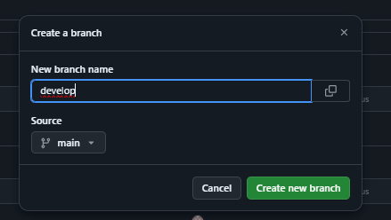

Markdown
# proweb_miproyecto

## Creación del repositorio y configuración inicial

### Crear el repositorio
1. Accede a GitHub y crea un nuevo repositorio.
2. Nombra el repositorio `proweb_miproyecto` (o el nombre que hayas elegido).
3. Inicializa el repositorio con un README.md.

### Agregar colaborador
1. Ve a los Settings del repositorio.
2. En la sección "Collaborators", agrega a `wilfredvasquez`.

### Crear branches
1. En la pestaña "Code", crea los siguientes branches:
   * main
   * staging
   * develop

### Crear el README.md
1. Crea un nuevo archivo llamado `README.md`.
2. Edita el archivo con el contenido de este documento.

## Estructura del proyecto
* **main:** Branch principal para la versión estable.
* **staging:** Branch para integraciones antes de pasar a producción.
* **develop:** Branch para el desarrollo activo.

**¡Gracias por tu contribución!**
